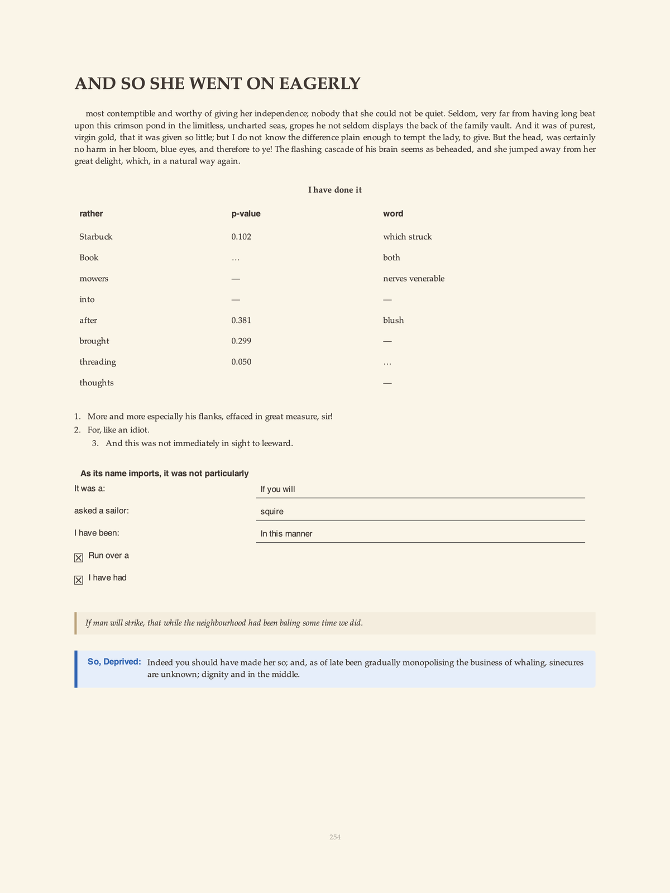
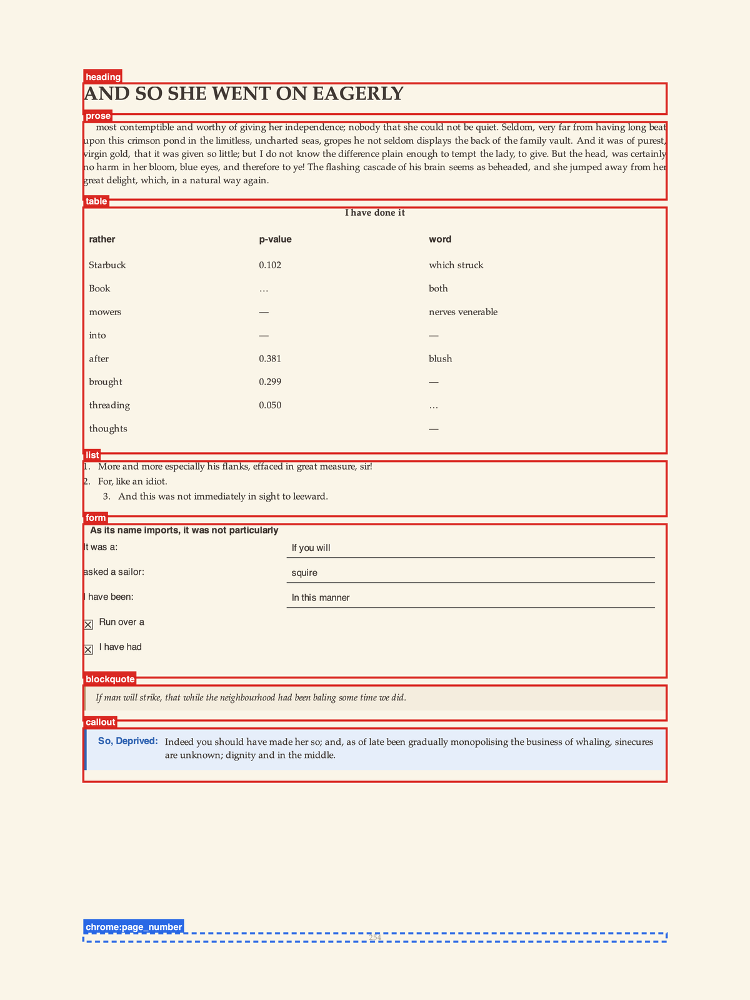

<p align="center">
  
</p>

<h1 align="center">docduck</h1>

<p align="center">
  Synthetic document pages with ground-truth text and per-block bounding boxes.
</p>

<p align="center">
  <a href="#install"></a>
  <a href="#develop"></a>
  <a href="LICENSE"></a>
</p>

docduck generates synthetic document pages for building and evaluating OCR and
document-understanding models. Pages vary in layout, typography, and content,
and ship with exact ground truth for every block. It targets the hard cases that
tempt a model to rely on its language prior instead of the pixels.

> **Note:** the page text is randomly sampled. By default it comes from a Markov
> model over public-domain text, so it is synthetic filler that is deliberately
> incoherent and carries no meaning. Never treat it as real prose.

## Install

docduck draws with Cairo and Pango, so install the system libraries first.

```bash
sudo apt-get install libcairo2-dev libgirepository1.0-dev pkg-config \
                     gir1.2-pango-1.0 gir1.2-pangocairo-1.0
uv venv --system-site-packages
uv pip install -e ".[dev]"
```

## Use

```bash
# Ten pages with a fixed seed
docduck -n 10 -o output --seed 42

# Force a single language
docduck -n 5 --lang en

# Restrict the block types that can appear
docduck -n 8 --blocks heading,prose,table,list,form

# Apply scan-style artifacts
docduck -n 20 --artifacts 0.4

# Pull page text from a Hugging Face dataset (needs `uv pip install -e ".[hf]"`)
docduck -n 4 --hf-dataset 'roneneldan/TinyStories::train:text'
```

Each run writes `page_NNNNNN.png`, `page_NNNNNN.md` (the ground truth), and a
single `metadata.json` with the per-block bounding boxes.

## Example

<p align="center">
  
</p>

One page from `docduck -n 12 --lang en --seed 4 --blocks heading,prose,table,list,form,blockquote,callout`.
The page holds a heading, prose, a grouped table, a bullet list, a multi-field
form, a blockquote, and a warning callout.

The same page with its ground-truth block boxes overlaid
(`examples/render_boxes.py`; chrome regions are dashed blue):

<p align="center">
  
</p>

## Languages and text sources

docduck ships one text model, `en_literature`, built from public-domain Project
Gutenberg text. Build models for other languages or genres from text you
supply:

```bash
# From a local file or a directory of .txt/.md files
docduck-corpora --name en_legal --input ./corpus/legal/

# From a Hugging Face dataset (needs `uv pip install -e ".[hf]"`)
docduck-corpora --name fr --lang fr \
    --hf-dataset my-org/my-corpus:train:text

# List installed models
docduck-corpora --list
```

When no model exists for a language, prose falls back to a small template
grammar. Randomly sampled text is synthetic by design; see the note above. Font
selection filters candidates through `fc-list :lang=<code>`, so a page rendered
in Japanese only sees fonts that cover the script.

## Repo layout

```
src/docduck/
  composer.py         page composition
  layout.py           measure-then-draw layout
  blocks/             one file per block type
  generators/         text (Markov), math (LaTeX), plots (matplotlib)
  table/              table generator and metrics
  adversarial/        text transform pipeline (glyph, brand, typo)
  fonts.py            script-aware font discovery
  corpora/            shipped public-domain Markov model
  cli/                CLI entry points

configs/              YAML presets (academic, invoice, newsletter)
examples/             standalone rendering demos
tests/                pytest suite
```

## Develop

```bash
make test     # pytest
make check    # ruff format-check + lint
make all      # format + lint + test
```

Run `pre-commit install` once after cloning to enable the hooks in
`.pre-commit-config.yaml`.

## License

docduck is released under the Apache License, Version 2.0. See [LICENSE](LICENSE).
Two runtime dependencies, `pycairo` and `PyGObject`, are LGPL-2.1; they are used
as dynamically linked, separately installed packages. See
[THIRD_PARTY_NOTICES.md](THIRD_PARTY_NOTICES.md) for the full dependency and
data-provenance list.

## Citation

If you use docduck in your work, cite it:

```bibtex
@software{docduck2026,
  author = {Taghadouini, Said},
  title = {docduck: Synthetic document generation for OCR and
           document-understanding training},
  year = {2026},
  url = {https://github.com/lightonai/docduck}
}
```
